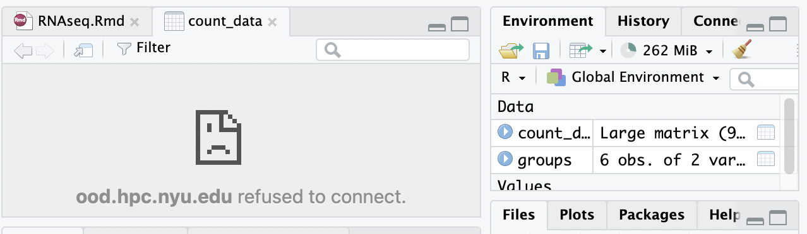
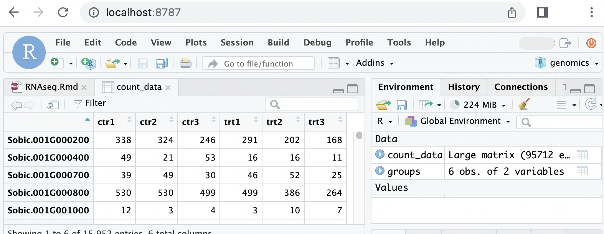

# No OpenOnDemand

After the maintenance, the OOD is much better now.

It felt good the first time I used it. But after using it many times, the problems started to show up.

1. Frequently log you out (pretty annoying)
2. RStudio cannot view data (annoying too) (fixed)
3. RStudio is sometimes hard to start  (fixed by refreshing)
4. no nodejs => cannot install jupyter-lab plugins



Solution:

1. RStudio: use [shared files](#existing-rstudio)
2. [Jupyter lab](#jupyter-lab) (can but take `$SCRATCH` space)

## RStudio Server

use existing singularity containers OR build own

### Explanation

Once you run an OpenOnDemand instance, you will have a folder containing all the script. 

I was inspired by the `setup.sh` and this repository: [grst/rstudio-server-conda](https://github.com/grst/rstudio-server-conda).

Key lines of `setup.sh`

```bash
# the location of r and r studio server
elif [[ "r/gcc/4.2.0" =~ ^r/gcc/4.2.0 ]]; then
  R_SINGULARITY="r4.2.0-ubuntu22.04-20220614.sqf" 
  RSTUDIO="rstudio-server-2022.07.1-554-ubuntu-22.04.sqf"
  OS="ubuntu-22.04.sif"
  TEXLIVE="" 
  ADDITIONAL_OPTIONS="--server-user ${USER}"
fi

# ......

# how to run r studio server by singularity
singularity exec $nv \
    --overlay "${TEXLIVE}" \
    --overlay /scratch/work/public/singularity/${R_SINGULARITY}:ro \
    --overlay /scratch/work/public/singularity/${RSTUDIO}:ro \
    /scratch/work/public/singularity/${OS} \
    /usr/lib/rstudio-server/bin/rserver ${ADDITIONAL_OPTIONS} \
      --database-config-file=$SLURM_TMPDIR/database.conf \
      --server-data-dir=$server_data_dir \
      --www-port="${port}" \
      --secure-cookie-key-file="$SLURM_TMPDIR/rstudio-server/secure-cookie-key" \
      --auth-none=1 \
      --auth-pam-helper-path="${RSTUDIO_AUTH}" \
      --auth-encrypt-password=0 \
      --rsession-path "${RSESSION_WRAPPER_FILE}" \
      --rsession-which-r /usr/local/bin/R
```

1. R and RStudio is stored in `xxx.sqf`
2. use `/usr/lib/rstudio-server/bin/rserver` to run rstudio
3. R path and R session path are needed
4. Use `--www-port` to specify the port

### Existing RStudio

ssh connect (your computer)

```
# local forwarding
ssh -L 8787:localhost:8787 <NetID>@greene.hpc.nyu.edu
```

In compute node

```bash
# if not in log-in node
if ! [[ `hostname` =~ "log" ]]; then
    # remote forwarding
    ssh -NfR 8787:localhost:8787 log-1
    ssh -NfR 8787:localhost:8787 log-2
    ssh -NfR 8787:localhost:8787 log-3
fi

singularity exec \
  --overlay /scratch/work/public/singularity/r4.2.0-ubuntu22.04-20220614.sqf:ro \
  --overlay /scratch/work/public/singularity/rstudio-server-2022.07.1-554-ubuntu-22.04.sqf:ro \
  --bind $HOME/no-ood/database.conf:/etc/rstudio/database.conf \
  --bind $HOME/no-ood/rsession.conf:/etc/rstudio/rsession.conf \
  /scratch/work/public/singularity/ubuntu-22.04.sif \
    /usr/lib/rstudio-server/bin/rserver \
      --server-user $USER \
      --server-data-dir=$SCRATCH/.local/share/server-data \
      --rsession-which-r=/usr/local/bin/R \
      --rsession-ld-library-path=$SCRATCH/R/R-4.2/lib \
      --www-address=127.0.0.1 \
      --www-port=8787 \
      --server-daemonize=0 \
      --auth-none=1
```

`$HOME/no-ood/database.conf`: where to store the RStudio database

```
provider=sqlite
directory=/scratch/<NetID>/rstudio-server
```

try this script

```bash
mkdir -p $HOME/no-ood
echo "provider=sqlite" > $HOME/no-ood/database.conf
echo "directory=$SCRATCH/rstudio-server" >> $HOME/no-ood/database.conf
```

`$HOME/no-ood/rsession.conf`: write anything you want.



DO NOT forget to quit the session. If not, your data may be lost.

## Jupyter Lab

1. module load anaconda
2. install an env in $SCRATCH
3. install jupyter lab in that env
4. edit script

install env and jupyter lab

```bash
# load the module
module load anaconda3/2020.07

# install jupyter lab at $SCRATCH
conda create --prefix $SCRATCH/env jupyterlab

# clear cache
conda clean --all
```

script to run jupyter lab

```bash
#!/bin/bash
#
# 1. module load anaconda
# 2. conda initialize
# 3. activate $SCRATCH/env
# 4. go to the directory
# 5. launch the jupyter lab

module load anaconda3/2020.07

# >>> conda initialize >>>
# !! Contents within this block are managed by 'conda init' !!
__conda_setup="$('/share/apps/anaconda3/2020.07/bin/conda' 'shell.bash' 'hook' 2> /dev/null)"
if [ $? -eq 0 ]; then
    eval "$__conda_setup"
else
    if [ -f "/share/apps/anaconda3/2020.07/etc/profile.d/conda.sh" ]; then
        . "/share/apps/anaconda3/2020.07/etc/profile.d/conda.sh"
    else
        export PATH="/share/apps/anaconda3/2020.07/bin:$PATH"
    fi
fi
unset __conda_setup
# <<< conda initialize <<<

conda activate $SCRATCH/env

# if not in log-in node
if ! [[ `hostname` =~ "log" ]]; then
    # remote forwarding
    ssh -NfR 8080:localhost:8080 log-1
    ssh -NfR 8080:localhost:8080 log-2
    ssh -NfR 8080:localhost:8080 log-3
fi

# if input a path
if [ -d $1 ]; then
    cd $1
fi

jupyter lab --no-browser --port 8080
```

## `srun` VS `sbatch`

`srun` is recommended, but `sbatch` is fine.

- If you try to run something interactive, use `srun`.
  - like `bash`, `jupyter lab`, `code-server`
- If you want to run some script, use `sbatch`.
  - `fastqc`, `trimmomatic`, ...

## Mamba and RStudio

Personally, I use singularity and mamba to manage the environment.

- pros: easy install, no compile time

1. build own singularity image from [cuda-neo-code-rstudio.def](singularity-def/cuda-neo-code-rstudio.def)
2. install mamba in singularity overlay
3. [install R by mamba](https://anaconda.org/conda-forge/r-base)
4. run the image with overlay

REMEMBER: use `mamba` OR `renv::install()` not `install.packages()`

### Build the Image

more detail, see [this](singularity.md#build-your-own-image)

```
# on local machine, you are not super user on HPC
sudo singularity build cuda-neo-code-rstudio.sif cuda-neo-code-rstudio.def
```

Once completed, copy it to HPC `~/no-ood/`

### Create a overlay and install mambaforge

```bash
# create a 20 GiB overlay image
singularity overlay create -s 20480 $SCRATCH/container/no-ood.img

# run singularity with overlay
singularity shell \
    --overlay $SCRATCH/container/no-ood.img\
    $HOME/no-ood/cuda-neo-code-rstudio.sif
```

in container install mamba

```bash
mkdir -p /ext3
wget https://github.com/conda-forge/miniforge/releases/latest/download/Mambaforge-Linux-x86_64.sh
bash Mambaforge-Linux-x86_64.sh -b -p /ext3/mambaforge
```

`/ext3/env.sh` autogenerated code + your own

```bash
# >>> conda initialize >>>
# !! Contents within this block are managed by 'conda init' !!
__conda_setup="$('/ext3/mambaforge/bin/conda' 'shell.bash' 'hook' 2> /dev/null)"
if [ $? -eq 0 ]; then
    eval "$__conda_setup"
else
    if [ -f "/ext3/mambaforge/etc/profile.d/conda.sh" ]; then
        . "/ext3/mambaforge/etc/profile.d/conda.sh"
    else
        export PATH="/ext3/mambaforge/bin:$PATH"
    fi
fi
unset __conda_setup

if [ -f "/ext3/mambaforge/etc/profile.d/mamba.sh" ]; then
    . "/ext3/mambaforge/etc/profile.d/mamba.sh"
fi
# <<< conda initialize <<<
```

### Install R

```bash
mamba install -c conda-forge r-base
```

### Run with Singularity

```bash
# if not in log-in node
if ! [[ `hostname` =~ "log" ]]; then
    # remote forwarding
    ssh -NfR 8080:localhost:8080 log-1
    ssh -NfR 8080:localhost:8080 log-2
    ssh -NfR 8080:localhost:8080 log-3
fi

singularity exec\
  --overlay $SCRATCH/container/no-ood.img \
  --bind $HOME/no-ood/database.conf:/etc/rstudio/database.conf \
  --bind $HOME/no-ood/rsession.conf:/etc/rstudio/rsession.conf \
  $HOME/no-ood/cuda-neo-code-rstudio.sif \
  /usr/lib/rstudio-server/bin/rserver \
    --server-user $USER \
    --server-data-dir=/ext3/.local/share/server-data \
    --rsession-which-r=/ext3/mambaforge/bin/R \
    --rsession-ld-library-path=/ext3/mambaforge/lib \
    --www-address=127.0.0.1 \
    --www-port=8080 \
    --server-daemonize=0 \
    --auth-none=1
```

`$HOME/no-ood/database.conf`: where to store the RStudio database

```
provider=sqlite
directory=/scratch/<NetID>/rstudio-server
# or directory=/ext3/rstudio-server
```

`$HOME/no-ood/rsession.conf`: write anything you want.
