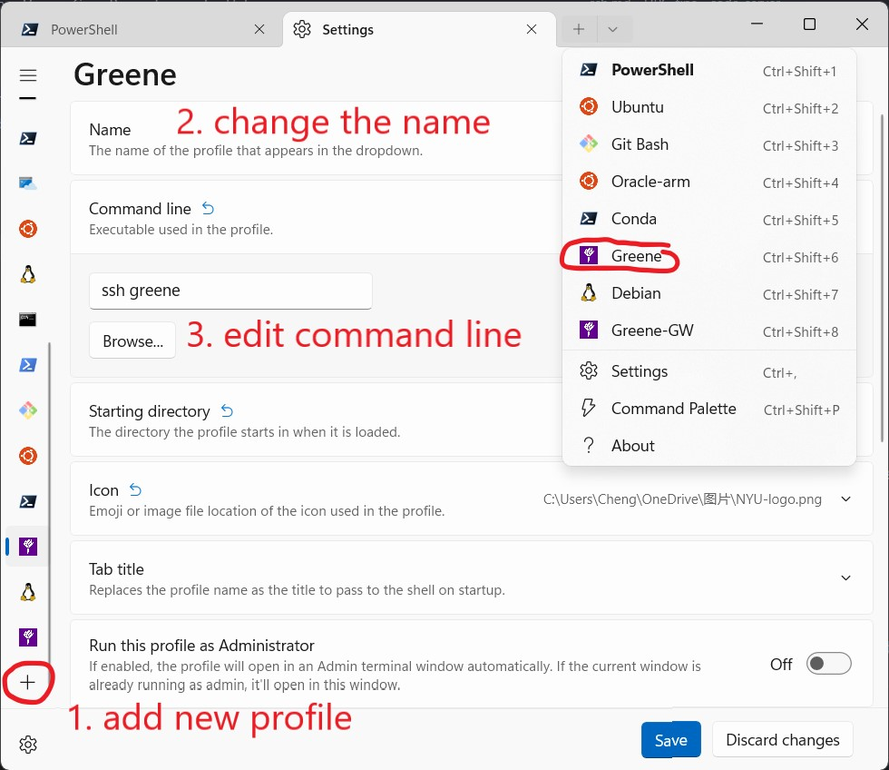

# TOC

- [Login without password](#public-key-authentication)
- [SSH Config File](#config-file)
- [Troubleshooting](#troubleshooting)

# SSH

SSH: Secure Shell

- connect to a remote machine, and run commands
- [OpenSSH](https://www.openssh.com/)
  - built-in on Linux and Mac OS
  - [OpenSSH - Microsoft Learn](https://learn.microsoft.com/en-us/windows/terminal/tutorials/ssh) maybe pre-installed on Windows.

```bash
ssh username@server
```

e.g.

```bash
ssh zz999@greene.hpc.nyu.edu
```

## Public Key Authentication

- private key: on local machine
- public key: on server

You can use `ssh -i <path to the private key> user@host` to login without password, more information on [ssh.com](https://www.ssh.com/academy/ssh/public-key-authentication)

1. Use `ssh-keygen` to generate key pairs
  - `-f`: key path
  - `-q`: Silence ssh-keygen
  - `-N`: "New" Provides a new passphrase for the key.
  - more parameters on [ssh.com](https://www.ssh.com/academy/ssh/keygen)
2. append public key to the host `~/.ssh/authorized_keys`
  - If you do not have one, just copy the server
  - [Append public key - StackOverflow](https://stackoverflow.com/questions/23591083/how-to-append-authorized-keys-on-the-remote-server-with-id-rsa-pub-key)
3. login with the key

```bash
cd ~ # go to home directory
ssh-keygen -f .ssh/id_rsa -N "" # generate key pairs
scp .ssh/id_rsa.pub user@server:.ssh/authorized_keys # copy the public key to the server
ssh -i ~/.ssh/id_rsa user@server # login to the server
```

You can change zz999 to your netID.

```bash
cd ~ # go to home directory
ssh-keygen -f .ssh/greene -N "" # generate key pairs
scp .ssh/greene.pub zz999@greene.hpc.nyu.edu:.ssh/authorized_keys # copy the public key to the server
ssh -i ~/.ssh/greene zz999@greene.hpc.nyu.edu # login to the server
```

Here I copied the key directly, but I should append it. [Append public key - StackOverflow](https://stackoverflow.com/questions/23591083/how-to-append-authorized-keys-on-the-remote-server-with-id-rsa-pub-key)

```
ssh user@server "echo \"`cat ~/.ssh/id_rsa.pub`\" >> .ssh/authorized_keys"
```

It does not work on powershell. You can also copy to the server and append it. The server may have `id_rsa.pub`. Backup in advance, or use a different name.

```
scp ~/.ssh/greene.pub user@server:.ssh/ # copy the key to the server
ssh user@server # login server
```

on server

```
cat ~/.ssh/greene.pub >> ~/.ssh/authorized_keys # append the public key to the 
```

## Config File

default path is `~/.ssh/config`, more parameters on [ssh.com](https://www.ssh.com/academy/ssh/config)

```
# Login with private key, no password required
Host greene
  HostName greene.hpc.nyu.edu
  User <your netID>
  IdentityFile ~/.ssh/greene
  ForwardAgent yes

# proxy jump, no VPN required, password for the gateway
Host greene-gw
  HostName greene.hpc.nyu.edu
  User <your netID>
  IdentityFile ~/.ssh/greene
  ProxyJump <your netID>@gw.hpc.nyu.edu
  ForwardAgent yes
```

So you can easily login with

```bash
ssh greene
```

instead of

```bash
ssh -i ~/.ssh/greene <your netID>@gw.hpc.nyu.edu
```

# Shortcut On Windows Terminal

1. Add new profile
2. Change the `name`
3. Edit `command line` to `ssh xxx`
4. [Change the Icon]
5. Save
6. login with one click



# Troubleshooting

## REMOTE HOST IDENTIFICATION HAS CHANGED!

If the server's key does not match the key saved on your computer (`~/.ssh/known_hosts`), this will pop up.

```
@@@@@@@@@@@@@@@@@@@@@@@@@@@@@@@@@@@@@@@@@@@@@@@@@@@@@@@@@@@
@    WARNING: REMOTE HOST IDENTIFICATION HAS CHANGED!     @
@@@@@@@@@@@@@@@@@@@@@@@@@@@@@@@@@@@@@@@@@@@@@@@@@@@@@@@@@@@
IT IS POSSIBLE THAT SOMEONE IS DOING SOMETHING NASTY!
Someone could be eavesdropping on you right now (man-in-the-middle attack)!
It is also possible that a host key has just been changed.
The fingerprint for the ED25519 key sent by the remote host is
SHA256:xxxxxxxxxxxxxxxxxxxxxxxxxxxxxxxxxxxxxxxxxxx.
Please contact your system administrator.
Add correct host key in ~/.ssh/known_hosts to get rid of this message.
Offending ECDSA key in ~/.ssh/known_hosts:25
Host key for greene.hpc.nyu.edu has changed and you have requested strict checking.
Host key verification failed.
```

possible reasons:

1. man-in-the-middle attack
2. server changed
3. different servers with same domain

### Different servers with same domain

Every time you use ssh, it checks the server key with the key stored in `~/.ssh/known_hosts`.

If the key does not match, it will stop and warn you.

This is how it stored in `~/.ssh/known_hosts`.

```
; hostname key_type key_content
greene.hpc.nyu.edu ssh-rsa AAAAB3Nza.....
greene.hpc.nyu.edu ecdsa-sha2-nistp256 AAAAE2VjZHNhLXNo.....
greene.hpc.nyu.edu ssh-ed25519 AAAAC3NzaC1...
```

Suppose we have logged in to login node 1 and saved the corresponding key. Then we log into node 2 using the same domain name. `ssh` will check if the key of node 2 is the same as the saved key. But the saved key is for node 1. So it will panic.

The solution:

1. Comment out the key after connecting using semicolon `;`
2. Reconnect to the server
3. Repeat 1 and 2 until you get the keys for all the login nodes
4. Remove duplicate keys
5. Add `log#` in front of the keys (Just make sure the hostname is DIFFERENT. Whether it corresponds or not is not important)

e.g.

```
greene.hpc.nyu.edu ssh-rsa AAAAB3Nza.....
greene.hpc.nyu.edu ecdsa-sha2-nistp256 AAAAE2VjZHNhLXNo.....

log1.greene.hpc.nyu.edu ssh-ed25519 AAA
log2.greene.hpc.nyu.edu ssh-ed25519 BBB
log3.greene.hpc.nyu.edu ssh-ed25519 CCC
```