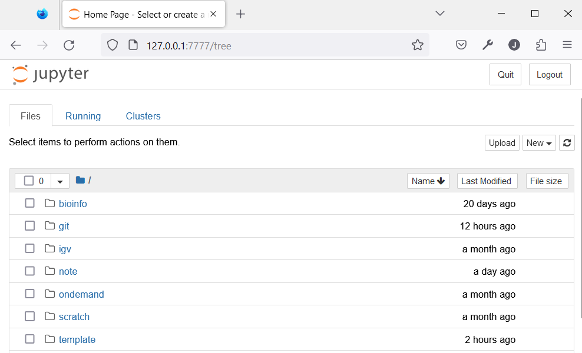

# TOC

- [Login without password](#public-key-authentication)
- [SSH Config File](#config-file)
- [Troubleshooting](#troubleshooting)

# SSH

SSH: Secure Shell

- connect to a remote machine, and run commands
- [OpenSSH](https://www.openssh.com/)
  - built-in on Linux and Mac OS
  - [OpenSSH - Microsoft Learn](https://learn.microsoft.com/en-us/windows/terminal/tutorials/ssh) maybe pre-installed on Windows.
  - iOS: [ShellFish](https://apps.apple.com/us/app/ssh-client-secure-shellfish/id1336634154), [Termius](https://apps.apple.com/us/app/termius-ssh-shell-console-terminal/id549039908)
  - Android: [Termux](https://github.com/termux/termux-app), [Termius](https://play.google.com/store/apps/details?id=com.server.auditor.ssh.client), [Juice SSH](https://play.google.com/store/apps/details?id=com.sonelli.juicessh)

```bash
ssh username@server
```

e.g.

```bash
ssh zz999@greene.hpc.nyu.edu
```

## Public Key Authentication

- private key: on local machine
- public key: on server

You can use `ssh -i <path to the private key> user@host` to login without password, more information on [ssh.com](https://www.ssh.com/academy/ssh/public-key-authentication)

1. Use `ssh-keygen` to generate key pairs
   - `-f`: key path
   - `-q`: Silence ssh-keygen
   - `-N`: "New" Provides a new passphrase for the key.
   - more parameters on [ssh.com](https://www.ssh.com/academy/ssh/keygen)
2. append public key to the host `~/.ssh/authorized_keys`
   - If you do not have one, just copy the server
   - [Append public key - StackOverflow](https://stackoverflow.com/questions/23591083/how-to-append-authorized-keys-on-the-remote-server-with-id-rsa-pub-key)
3. login with the key

```bash
cd ~ # go to home directory
ssh-keygen -f .ssh/id_rsa -N "" # generate key pairs
ssh-copy-id -i .ssh/id_rsa user@server # add public key to the host, not working on Windows
ssh -i ~/.ssh/id_rsa user@server # login to the server
```

You can change zz999 to your netID.

```bash
cd ~ # go to home directory
ssh-keygen -f .ssh/greene -N "" # generate key pairs
ssh-copy-id -i ~/.ssh/greene zz999@greene.hpc.nyu.edu # add public key to the host
ssh -i ~/.ssh/greene zz999@greene.hpc.nyu.edu # login to the server
```

Or you can copy all the text in public key, and add it to `authorized_keys`

```bash
cd ~
scp .ssh/greene.pub zz999@greene.hpc.nyu.edu:.ssh/ # copy the key to the server
ssh zz999@greene.hpc.nyu.edu # login server
```

on server

```bash
cat ~/.ssh/greene.pub >> ~/.ssh/authorized_keys # append the public key to the authorized_keys
rm ~/.ssh/greene.pub  # delete the public key
```

### Permission on SSH key

**DO NOT** share your private keys with anyone

- `chmod 600 ~/.ssh/id_rsa`
- `chmod 644 ~/.ssh/id_rsa.pub` or `600` if you want
- `chmod 700 ~/.ssh`

## Config File

- default path is `~/.ssh/config`, more parameters on [ssh.com](https://www.ssh.com/academy/ssh/config)
- can be used for `ssh` and `scp`

```
# Login with private key, no password required
Host greene
  HostName greene.hpc.nyu.edu
  User <your netID>
  IdentityFile ~/.ssh/greene
  ForwardAgent yes

# proxy jump, no VPN required, password for the gateway
Host greene-gw
  HostName greene.hpc.nyu.edu
  User <your netID>
  IdentityFile ~/.ssh/greene
  ProxyJump <your netID>@gw.hpc.nyu.edu
  ForwardAgent yes
```

So you can easily login and transfer file with

```bash
ssh greene

scp ~/files greene:/destination
```

instead of

```bash
ssh -i ~/.ssh/greene <your netID>@greene.hpc.nyu.edu

scp -i ~/.ssh/greene ~/files <your netID>@greene.hpc.nyu.edu:/destination
```

# LocalForward

With local forward, you can access remote port from local port.

NOTE: If you want to use port forwarding, you SHOULD have correct [remote host identification](#remote-host-identification-has-changed).

e.g. Because the jupyter version is quite old, you decide to use a newer one. You set up a conda environment and run jupyter. Now you can use local forward to access it.

```bash
ssh -L 8888:127.0.0.1:8888 zz999@greene.hpc.nyu.edu
# default port of jupyter is 8888
```

or in ssh config

```
# login node
Host greene
  HostName greene.hpc.nyu.edu
  User zz999
  IdentityFile ~/.ssh/greene
  StrictHostKeyChecking no
  UserKnownHostsFile /dev/null
  LocalForward 8888 localhost:8888
  ForwardAgent yes

# compute node
Host greene-cn
  HostName gr030
  User zz999
  IdentityFile ~/.ssh/greene
  StrictHostKeyChecking no
  UserKnownHostsFile /dev/null
  ProxyJump greene
  ForwardAgent yes
  RequestTTY yes
  LocalForward 8888 localhost:8888
```

# RemoteForward

With remote forward, you expose the port on compute node to login node. Therefore, you can access the port on compute node from the port of your local machine.

```
              Local            Remote
             Forward          Forward
 your computer ===> login node <=== compute node
localhost:8888 ====================> localhost:8888
```

e.g. on compute node

```bash
ssh -NfR 8888:localhost:8888 log-1
ssh -NfR 8888:localhost:8888 log-2
ssh -NfR 8888:localhost:8888 log-3
```



# Shortcut On Windows Terminal

1. Add new profile
2. Change the `name`
3. Edit `command line` to `ssh xxx` or `ssh -i key user@server`
4. [Change the Icon]
5. Save
6. Login with one click


# Troubleshooting

## REMOTE HOST IDENTIFICATION HAS CHANGED!

If the server's key does not match the key saved on your computer (`~/.ssh/known_hosts`), this will pop up.

```
@@@@@@@@@@@@@@@@@@@@@@@@@@@@@@@@@@@@@@@@@@@@@@@@@@@@@@@@@@@
@    WARNING: REMOTE HOST IDENTIFICATION HAS CHANGED!     @
@@@@@@@@@@@@@@@@@@@@@@@@@@@@@@@@@@@@@@@@@@@@@@@@@@@@@@@@@@@
IT IS POSSIBLE THAT SOMEONE IS DOING SOMETHING NASTY!
Someone could be eavesdropping on you right now (man-in-the-middle attack)!
It is also possible that a host key has just been changed.
The fingerprint for the ED25519 key sent by the remote host is
SHA256:xxxxxxxxxxxxxxxxxxxxxxxxxxxxxxxxxxxxxxxxxxx.
Please contact your system administrator.
Add correct host key in ~/.ssh/known_hosts to get rid of this message.
Offending ECDSA key in ~/.ssh/known_hosts:25
Host key for greene.hpc.nyu.edu has changed and you have requested strict checking.
Host key verification failed.
```

possible reasons:

1. man-in-the-middle attack
2. server changed
3. different servers with same domain
   - appears on Windows, Mac OS, on Ubuntu 22.04 ...

### Different servers with same domain

#### Solution

edit `~/.ssh/config` to

```
Host greene
  HostName greene.hpc.nyu.edu
  # ... anything else
  StrictHostKeyChecking no
  UserKnownHostsFile /dev/null
  # do not check key
```

and use `ssh greene` to login

#### Reason

Every time you use ssh, it checks the server key with the key stored in `~/.ssh/known_hosts`.

If the key does not match, it will stop and warn you.

```
; hostname key_type key_content
greene.hpc.nyu.edu ssh-rsa AAAAB3Nza.....
greene.hpc.nyu.edu ecdsa-sha2-nistp256 AAAAE2VjZHNhLXNo.....
greene.hpc.nyu.edu ssh-ed25519 AAAAC3NzaC1...
```

Suppose we have logged in to login node 1 and saved the corresponding key. Then we log into node 2 using the same domain name. `ssh` will check if the key of node 2 is the same as the saved key. But the saved key is for node 1. So it will panic.


# OpenSSH on Windows

- `ssh` works almost fine
  - some parameters do not work properly
- `scp` cannot recognize `~`
  - `~/.ssh/greene.pub: No such file or directory`
- no `ssh-copy-id`